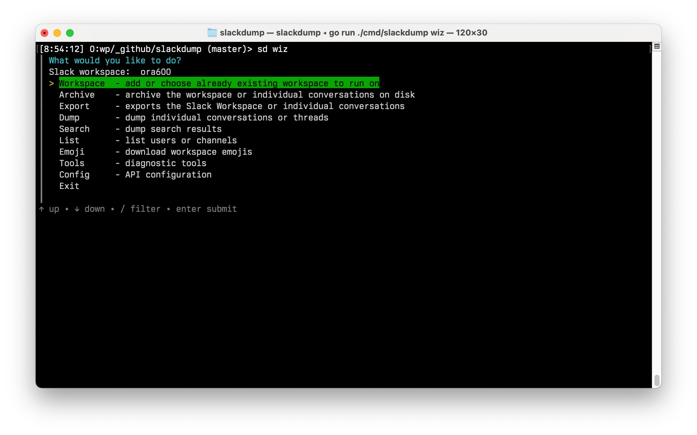

============
Slack Dumper
============

- `Buy me a cup of tea`_
- Join the discussion in Telegram_ or Slack_.
- `Read the overview on Medium.com`_
- |go ref|

.. contents::
   :depth: 2

|screenshot|

Description
===========

Purpose: dump Slack messages, users and files using browser token and cookie.

Typical use scenarios:

* archive your private conversations from Slack when the administrator
  does not allow you to install applications OR you don't want to use 
  potentially privacy-violating third-party tools, 
* archive channels from Slack when you're on a free "no archive" subscription,
  so you don't lose valuable knowledge in those channels.
* create a Slack Export archive without admin access.

There a three modes of operation (more on this in `User Guide`_) :

#. List users/channels
#. Dumping messages and threads
#. Creating a Slack Export.

Slackdump accepts two types of input (see `Dumping Conversations`_ section):

#. the URL/link of the channel or thread, OR 
#. the ID of the channel.

Quick Start
===========

#. Download the latest release for your operating system from the releases_
   page.
#. Unpack the archive to any directory.
#. Run the ``./slackdump`` or ``slackdump.exe`` executable (see note below).
#. You know the drill:  use arrow keys to select the menu item, and Enter (or
   Return) to confirm.

By default, Slackdump uses the EZ-Login 3000 automatic login, and interactive
mode.

.. NOTE::
  On Windows and macOS you may be presented with "Unknown developer" window,
  this is fine.  Reason for this is that the executable hasn't been signed by
  the developer certificate.

  To work around this:
  
  - **on Windows**: click "more information", and press "Run
    Anyway" button.
  - **on macOS**: open the folder in Finder, hold Option and double click the
    executable, choose Run.

User Guide
==========

For more advanced features and instructions, please see the `User Guide`_.

Using as a library
==================

Download:

.. code:: go

  go get github.com/rusq/slackdump/v2

Add the following line at the end of your project's ``go.mod`` file::

  replace github.com/slack-go/slack => github.com/rusq/slack v0.11.100

This is required, as Slackdump relies on custom authentication scheme
that uses cookies, and those functions are simply not in the original
library.

Example
-------
.. code:: go

  import (
    "github.com/rusq/slackdump/v2"
    "github.com/rusq/slackdump/v2/auth"
  )

  func main() {
    provider, err := auth.NewValueAuth("xoxc-...", "xoxd-...")
    if err != nil {
        log.Print(err)
        return
    }
    sd, err := New(context.Background(), provider)
    if err != nil {
        log.Print(err)
        return
    }
    _ = sd
  }

See |go ref|

Using Custom Logger
-------------------
Slackdump uses a simple `rusq/dlog`_ as a default logger (it is a wrapper around
the standard logger that adds `Debug*` functions). 

If you want to use the same default logger that Slackdump uses in your
application, it is available as ``logger.Default``.

No doubts that everyone has their own favourite logger that is better than other
miserable loggers.  Please read below for instructions on plugging your
favourite logger.

Logrus
~~~~~~
Good news is logrus_ can be plugged in straight away, as it implements the
``logger.Interface`` out of the box.

.. code:: go

  lg := logrus.New()
  sd, err := New(context.Background(), provider, WithLogger(lg))
    if err != nil {
        log.Print(err)
        return
    }
  }

Glog and others
~~~~~~~~~~~~~~~
If you need to use some other logger, such as glog_, it is a matter of wrapping
the calls to satisfy the ``logger.Interface`` (defined in the `logger`_
package), and then setting the ``Logger`` variable in `slackdump.Options` (see
`options.go`_), or using `WithLogger` option.

FAQ
===

:Q: **Do I need to create a Slack application?**

:A: No, you don't.  Just run the application and EZ-Login 3000 will take
    care of the authentication or, alternatively, grab that token and
    cookie from the browser Slack session.  See `User Guide`_.

:Q: **I'm getting "invalid_auth" error**

:A: Go get the new Cookie from the browser and Token as well.

:Q: **Slackdump takes a very long time to cache users**

:A: Disable the user cache with ``-no-user-cache`` flag.

:Q: **How to read the export file?**

:A: For Slack Workspace Export, use `slack export viewer`_.  For the generic
    dump files, see `examples`_ directory for some python and shell examples.

Bulletin Board
==============

Messages that were conveyed with the donations:

- 25/01/2022: Stay away from `TheSignChef.com`_, ya hear, they don't pay what
  they owe to their employees. 

.. _Application: https://stackoverflow.com/questions/12908881/how-to-copy-cookies-in-google-chrome
.. _`Buy me a cup of tea`: https://www.paypal.com/donate/?hosted_button_id=GUHCLSM7E54ZW
.. _Telegram: https://t.me/slackdump
.. _Slack: https://join.slack.com/t/newworkspace-wcx3986/shared_invite/zt-18kj2sdoj-jMi3aZMWwkbK5JNjne0dbQ
.. _`Read the overview on Medium.com`: https://medium.com/@gilyazov/downloading-your-private-slack-conversations-52e50428b3c2
.. _`Go templating`: https://pkg.go.dev/html/template
.. _User Guide: doc/README.rst
.. _Dumping Conversations: doc/usage-channels.rst
.. _rusq/dlog: https://github.com/rusq/dlog
.. _logrus: https://github.com/sirupsen/logrus
.. _glog: https://github.com/golang/glog
.. _logger: logger/logger.go
.. _options.go: options.go
.. _slack export viewer: https://github.com/hfaran/slack-export-viewer
.. _examples: examples
.. _releases: https://github.com/rusq/slackdump/releases/
..
  bulletin board links

.. _`TheSignChef.com`: https://www.glassdoor.com.au/Reviews/TheSignChef-com-Reviews-E793259.htm
.. _`Get cookies.txt Chrome extension`: https://chrome.google.com/webstore/detail/get-cookiestxt/bgaddhkoddajcdgocldbbfleckgcbcid

.. |go ref| image:: https://pkg.go.dev/badge/github.com/rusq/slackdump/v2.svg
              :alt: Go Reference
           :target: https://pkg.go.dev/github.com/rusq/slackdump/v2/

